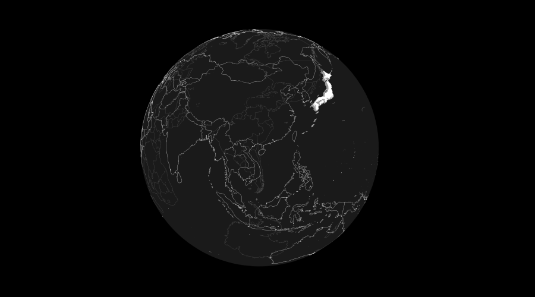

# three-geojson

[](https://github.com/gkjohnson/three-geojson/actions)
[](https://gkjohnson.github.io/tools/docs/three-geojson/)
[](https://github.com/gkjohnson/three-geojson/)
[](https://twitter.com/garrettkjohnson)
[](https://github.com/sponsors/gkjohnson/)



Three.js shape loaders for [GeoJSON](https://geojson.org/) ([readable html](https://stevage.github.io/geojson-spec/)) and [WKT](https://en.wikipedia.org/wiki/Well-known_text_representation_of_geometry) formats. Supports generation of three.js line geometry in addition to flat and extruded tringulated meshes. All generated geometry are transformed and centered using 64-bit Javascript floating point operations with meshes are offset to retain precision in GPU operations.

Uses [@turfjs/unkink-polygon](https://www.npmjs.com/package/@turf/unkink-polygon), [@mapbox/delaunator](https://github.com/mapbox/delaunator), [@kninnug/constrainautor](https://github.com/kninnug/Constrainautor), and [@placemark/betterknown](https://github.com/placemark/betterknown) packages for polygon triangulation and WKT parsing. World GeoJSON file courtesy of [geojson-maps](https://geojson-maps.kyd.au/).

Some key features supported by this project:
- Support for detecting and fixing self-intersecting polygons so they tringulate correctly.
- Uses constrained delaunay triangulation for correct, high quality triangulation and support for inner vertices.
- Smooth surface normals are generated for ellipsoid-projected shapes.
- Outputs centered geometry with and matrix transform offset to avoid preceision-related artifacts on CPU and GPU when processing high-detail shapes.
- Supports altitude values.

> [!NOTE]
> This project is not hosted on npm and must be installed via Github repository.

# Examples

[WGS84 Lines](https://gkjohnson.github.io/three-geojson/globe.html)

[WGS84 Extruded Polygons](https://gkjohnson.github.io/three-geojson/globe.html?country=.)

[WGS84 Wireframe Polygons](https://gkjohnson.github.io/three-geojson/globe.html?country=.&wireframe=true)

[Extruded Polygon](https://gkjohnson.github.io/three-geojson/extruded.html)

[WKT Polygon](https://gkjohnson.github.io/three-geojson/wkt.html)

# Installation

```
npm install github:@gkjohnson/three-geojson
```

# Use

```js
// load the content
const result = await new GeoJSON().loadAsync( url );

// extract polygon lines and project them onto the globe
const transformer = new GeoJSONTransformer();
result.polygons.forEach( polygon => {

  const line = polygon.getLineObject();
  transformer.transformObject( line );
  scene.add( line );

} );
```

# API

See [API.md](./API.md) for full API documentation.

The same documentation is also available on the [docs site](https://gkjohnson.github.io/tools/docs/three-geojson/).
